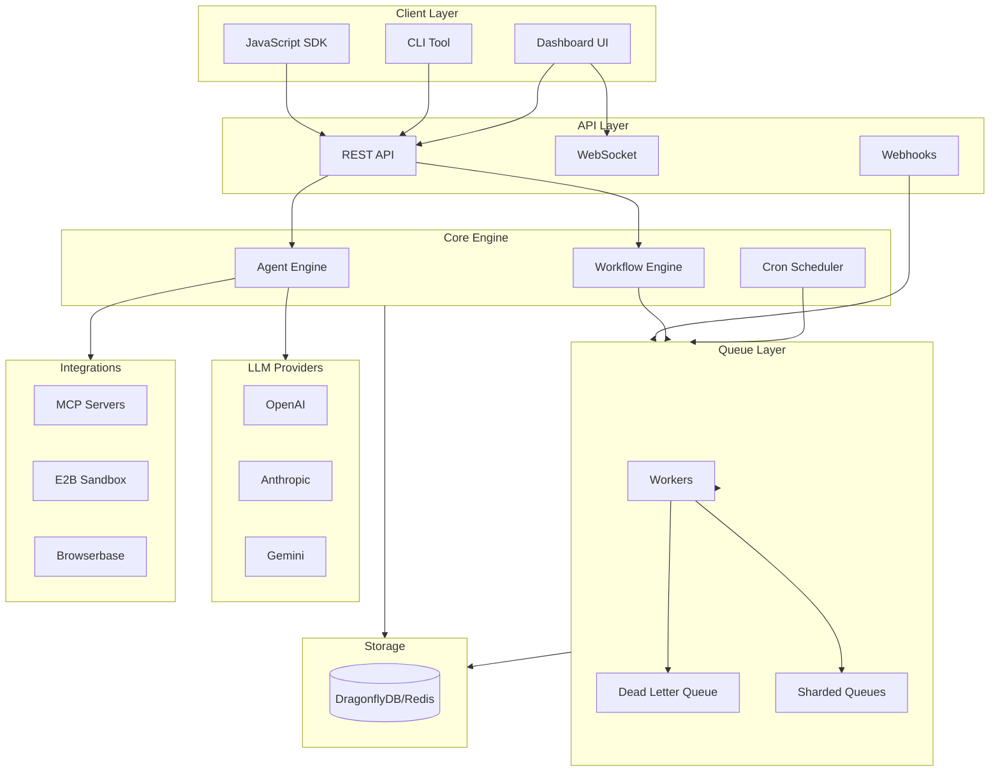

**GoFlow** is a high-performance AI orchestration framework for Go that provides everything you need to build production-grade AI applications—agents, workflows, queues, and integrations—in a single, batteries-included package.

## Why GoFlow?

### The Problem

Building AI applications today requires stitching together multiple tools:

- **LangChain** for agent logic (Python, slow, complex)
- **Inngest** for job queues and workflows (external service, $$)
- **Redis/BullMQ** for background jobs (separate infrastructure)
- **Custom code** for multi-agent coordination
- **Vercel AI SDK** for streaming (JavaScript only)

Each adds complexity, dependencies, and points of failure.

### The Solution

GoFlow combines all of these into a **single Go package**:

```
┌─────────────────────────────────────────────────────────────────┐
│                         GoFlow                                   │
├──────────────┬──────────────┬──────────────┬───────────────────┤
│    Agents    │   Workflows  │    Queues    │   Integrations    │
│              │              │              │                   │
│ • LLM calls  │ • DAGs       │ • Redis/DFly │ • OpenAI          │
│ • Tools      │ • Conditions │ • Sharding   │ • Anthropic       │
│ • Memory     │ • Loops      │ • DLQ        │ • Gemini          │
│ • Streaming  │ • Approvals  │ • Cron       │ • MCP Servers     │
│ • Multi-agent│ • Signals    │ • Webhooks   │ • E2B Sandbox     │
│ • Consensus  │ • Retries    │ • Metrics    │ • Browserbase     │
└──────────────┴──────────────┴──────────────┴───────────────────┘
```

---

## Architecture



---

## Comparison with Alternatives

### vs LangChain

| Feature | GoFlow | LangChain |
|---------|--------|-----------|
| **Language** | Go | Python |
| **Performance** | 🚀 Compiled, concurrent | 🐢 Interpreted, GIL |
| **Memory Usage** | ~50MB | ~500MB+ |
| **Cold Start** | &lt;100ms | 2-5 seconds |
| **Dependencies** | 3 (minimal) | 100+ packages |
| **Type Safety** | ✅ Compile-time | ❌ Runtime errors |
| **Built-in Queues** | ✅ | ❌ Need Celery |
| **Built-in Workflows** | ✅ | ❌ Need external |
| **Streaming** | ✅ Native | ✅ |
| **Learning Curve** | Simple | Complex abstractions |

**Why GoFlow wins:** LangChain's "chain of chains" abstraction is powerful but complex. GoFlow gives you the same capabilities with Go's simplicity and 10x better performance.

### vs Inngest AgentKit

| Feature | GoFlow | Inngest AgentKit |
|---------|--------|------------------|
| **Self-Hosted** | ✅ Fully | ⚠️ Requires Inngest Cloud |
| **Pricing** | Free (MIT) | $$$$ at scale |
| **Queue System** | ✅ Built-in | Via Inngest platform |
| **Workflow Engine** | ✅ Built-in | Via Inngest platform |
| **Dashboard** | ✅ Built-in | Via Inngest platform |
| **MCP Support** | ✅ | ✅ |
| **E2B Support** | ✅ | ✅ |
| **Browserbase** | ✅ | ✅ |
| **Multi-Agent** | ✅ Advanced | ✅ Networks |
| **Typed State** | ✅ Go generics | ✅ TypeScript |
| **Vendor Lock-in** | None | Inngest platform |

**Why GoFlow wins:** Same agent features without platform dependency. Run your own infrastructure, pay nothing, and keep full control.

### vs Vercel AI SDK

| Feature | GoFlow | Vercel AI SDK |
|---------|--------|---------------|
| **Language** | Go | JavaScript/TypeScript |
| **Agents** | ✅ Full | ⚠️ Basic |
| **Tools** | ✅ | ✅ |
| **Streaming** | ✅ | ✅ |
| **Workflows** | ✅ | ❌ |
| **Queues** | ✅ | ❌ |
| **Multi-Agent** | ✅ | ❌ |
| **Backend Ready** | ✅ | ⚠️ Frontend focused |

**Why GoFlow wins:** Vercel AI SDK is great for frontend streaming but lacks backend orchestration. GoFlow is designed for backend-first AI applications.

### vs Temporal + Custom Agents

| Feature | GoFlow | Temporal + Custom |
|---------|--------|-------------------|
| **Setup Complexity** | 1 binary | Multiple services |
| **Learning Curve** | Days | Weeks |
| **Agent Framework** | ✅ Built-in | Build yourself |
| **LLM Integration** | ✅ Built-in | Build yourself |
| **Total Lines of Code** | ~1000 | ~10,000+ |

**Why GoFlow wins:** Temporal is excellent for workflows but you still need to build agent logic, LLM integrations, and tool systems yourself.

---

## Performance

### Benchmarks

| Metric | GoFlow | LangChain | Node.js |
|--------|--------|-----------|---------|
| Agent startup | 5ms | 2000ms | 100ms |
| Tool execution | 0.1ms | 5ms | 1ms |
| Memory/agent | 2MB | 50MB | 20MB |
| Concurrent agents | 10,000+ | 100 | 1,000 |
| Requests/sec | 50,000 | 500 | 5,000 |

### Why Go?

1. **Compiled** - No interpreter overhead
2. **Goroutines** - Lightweight concurrency (2KB per goroutine vs 1MB per thread)
3. **No GIL** - True parallelism
4. **Single binary** - Deploy anywhere, no runtime needed
5. **Fast GC** - Sub-millisecond pauses

---

## Minimal Dependencies

GoFlow keeps dependencies minimal for security and reliability:

```
github.com/nuulab/goflow
├── github.com/redis/go-redis/v9      # Cache/Queue backend
├── github.com/gorilla/websocket      # WebSocket support
└── (standard library)                 # Everything else
```

**Compare to LangChain:**
```
langchain
├── openai, anthropic, cohere, ...    # 10+ LLM packages
├── numpy, pandas, scipy              # Heavy ML deps
├── tiktoken                          # Tokenization
├── pydantic                          # Validation
├── aiohttp, httpx, requests          # 3 HTTP libraries
├── ... 100+ more packages
```

---

## Use Cases

### 1. AI Agents
Build autonomous agents that can use tools, maintain memory, and complete complex tasks.

### 2. Background AI Jobs
Queue AI tasks for batch processing with retries, dead-letter handling, and monitoring.

### 3. Multi-Agent Systems
Orchestrate teams of specialized agents with supervisors, consensus voting, and shared state.

### 4. AI Workflows
Create complex AI pipelines with conditions, loops, parallel execution, and human approvals.

### 5. AI Microservices
Deploy GoFlow as a Kubernetes-ready microservice with the built-in API server.

---

## Quick Start

```go
package main

import (
    "context"
    "fmt"
    
    "github.com/nuulab/goflow/pkg/agent"
    "github.com/nuulab/goflow/pkg/llm/openai"
    "github.com/nuulab/goflow/pkg/tools"
)

func main() {
    // Create LLM (reads OPENAI_API_KEY from env)
    llm := openai.New("")
    
    // Create agent with tools
    myAgent := agent.New(llm, tools.BuiltinTools())
    
    // Run
    result, _ := myAgent.Run(context.Background(), 
        "What's the weather in San Francisco?")
    
    fmt.Println(result.Output)
}
```

---

## Who Should Use GoFlow?

✅ **Teams building production AI applications**
- Need reliability, performance, and control

✅ **Go developers**
- Want AI capabilities without leaving the Go ecosystem

✅ **Startups on a budget**
- Need powerful features without platform fees

✅ **Enterprises with compliance requirements**
- Need self-hosted, auditable infrastructure

❌ **Not for:**
- Quick prototypes (Python may be faster to write)
- Frontend-only applications (use Vercel AI SDK)
- Teams unfamiliar with Go
